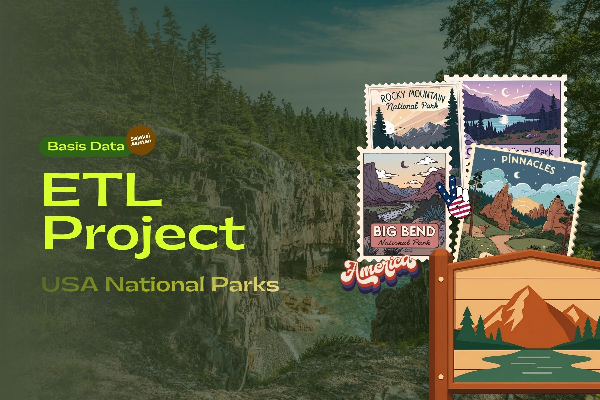
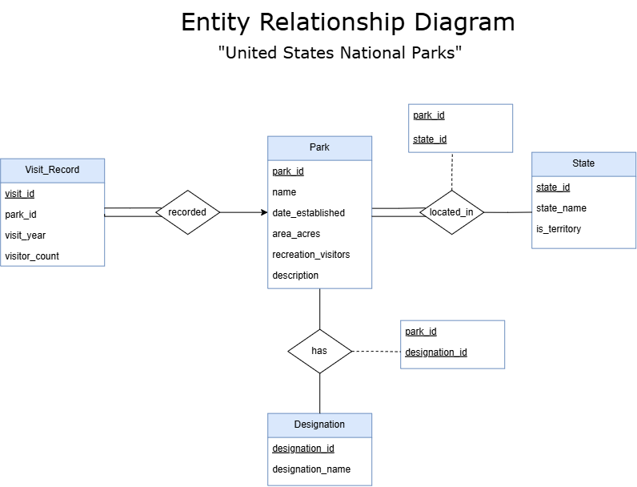
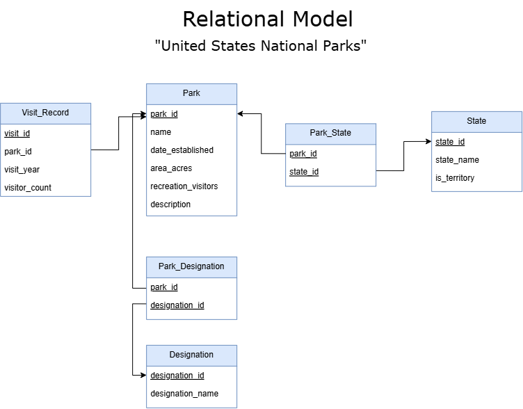
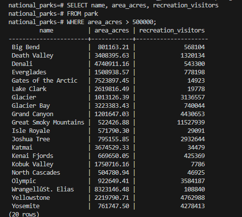
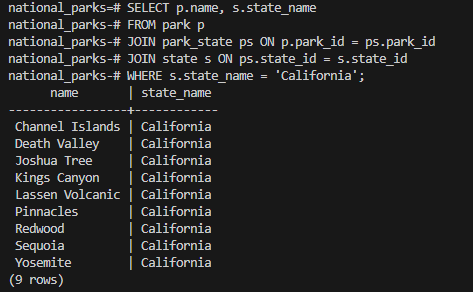
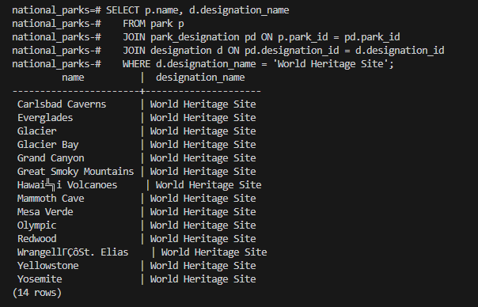
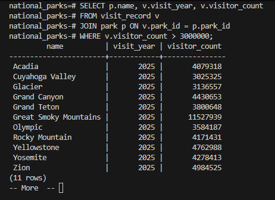

# Seleksi Tahap 2 Asisten Basis Data 2026 — ETL Project



## Deskripsi Singkat

Proyek ini merupakan hasil pengerjaan seleksi tahap 2 Asisten Basis Data 2026, yang meliputi proses **ETL** (*Extract, Transform, Load*): melakukan *data scraping*, merancang model basis data, lalu menyimpan hasilnya ke dalam RDBMS.

Topik awal yang direncanakan dalam proyek ini adalah Data Pemain FIFA World Cup 2026™. Namun, topik tersebut kemudian dialihkan karena terdapat pertimbangan terkait kepatuhan terhadap kebijakan dan ketentuan penggunaan situs sumber. Selain itu, pada saat proyek dimulai, penyelenggaraan FIFA World Cup 2026™ masih berlangsung sehingga data statistik yang tersedia belum bersifat final. Oleh karena itu, 
topik yang jadinya saya angkat adalah **Taman Nasional Amerika Serikat (National Parks of the United States)**, yang di-*scrape* dari halaman Wikipedia [*List of national parks of the United States*](https://en.wikipedia.org/wiki/List_of_national_parks_of_the_United_States). Halaman tersebut memuat dua tabel utama yang relevan untuk dijadikan basis data relasional:

1. Daftar 63 taman nasional beserta lokasi (negara bagian), tanggal penetapan, luas area, jumlah pengunjung, status pengakuan UNESCO (*World Heritage Site* / *Biosphere Reserve*), dan deskripsi singkat.
2. Rekapitulasi jumlah taman nasional per negara bagian/teritori (total, eksklusif, dan yang berbagi dengan negara bagian lain).

Topik ini dipilih karena datanya terstruktur dalam bentuk tabel HTML yang jelas namun tetap memerlukan proses pembersihan (menghapus catatan kaki, simbol UNESCO, memisahkan nama negara bagian, mem-parsing angka luas area dan jumlah pengunjung), serta memiliki relasi yang natural untuk dimodelkan secara relasional (taman ↔ negara bagian bersifat *many-to-many*, taman ↔ status UNESCO juga *many-to-many*, dan taman ↔ data kunjungan tahunan bersifat *one-to-many*).

Basis data diimplementasikan menggunakan **PostgreSQL**.

## Cara Menggunakan Scraper

Script scraper berada di `Data_Scraping/src/scrape_national_parks.py`.

1. Install dependency yang dibutuhkan:
   ```bash
   pip install requests beautifulsoup4
   ```
2. Jalankan script dari folder `Data_Scraping/src`:
   ```bash
   python scrape_national_parks.py
   ```
3. Script akan:
   - Mengambil (fetch) halaman Wikipedia target.
   - Mem-parsing dua tabel `wikitable` pertama pada halaman tersebut (tabel daftar taman dan tabel rekap per negara bagian).
   - Melakukan *preprocessing* pada teks mentah (menghapus referensi/catatan kaki `[1]`, simbol penanda UNESCO `*`/`†`/`‡`, merapikan spasi berlebih, memisahkan daftar negara bagian, mem-parsing angka luas area dan jumlah pengunjung menjadi tipe numerik, serta mem-parsing status teritori).
   - Menyimpan hasilnya ke dua file terpisah: `parks.json` dan `states.json` pada folder `Data_Scraping/data`.
4. Output (`parks.json` dan `states.json`) kemudian digunakan sebagai input pada tahap *storing* (`Data_Storing/src/store_data.py`) untuk dimasukkan ke dalam RDBMS.

## Struktur File JSON Hasil Scraping

### `parks.json`
Berisi array objek, masing-masing merepresentasikan satu taman nasional:

| Field | Tipe | Keterangan |
|---|---|---|
| `name` | string | Nama taman nasional |
| `is_world_heritage_site` | boolean | Apakah taman berstatus UNESCO World Heritage Site |
| `is_biosphere_reserve` | boolean | Apakah taman berstatus UNESCO Biosphere Reserve |
| `states` | array of string | Negara bagian tempat taman berada (bisa lebih dari satu) |
| `date_established` | string | Tanggal penetapan taman |
| `area_acres` | number \| null | Luas area taman dalam satuan *acres* |
| `recreation_visitors` | number \| null | Jumlah kunjungan rekreasi pada tahun data diambil |
| `description` | string | Deskripsi singkat taman |

Contoh:
```json
{
  "name": "Acadia",
  "is_world_heritage_site": false,
  "is_biosphere_reserve": false,
  "states": ["Maine"],
  "date_established": "February 26, 1919",
  "area_acres": 49071.4,
  "recreation_visitors": 4079318,
  "description": "Covering most of Mount Desert Island and other coastal islands, ..."
}
```

### `states.json`
Berisi array objek, masing-masing merepresentasikan satu negara bagian/teritori:

| Field | Tipe | Keterangan |
|---|---|---|
| `state` | string | Nama negara bagian/teritori |
| `is_territory` | boolean | Apakah merupakan teritori (bukan negara bagian) |
| `total_parks` | number | Total taman nasional di wilayah tersebut |
| `exclusive_parks` | number | Taman yang seluruhnya berada di satu wilayah tersebut |
| `shared_parks` | number | Taman yang berbagi wilayah dengan negara bagian/teritori lain |

Contoh:
```json
{
  "state": "California",
  "is_territory": false,
  "total_parks": 9,
  "exclusive_parks": 8,
  "shared_parks": 1
}
```

## Struktur ERD dan Diagram Relasional

### Entity Relationship Diagram



Entitas yang dirancang:
- **Park**: entitas utama, menyimpan atribut taman nasional (`park_id`, `name`, `date_established`, `area_acres`, `recreation_visitors`, `description`).
- **State**: menyimpan negara bagian/teritori (`state_id`, `state_name`, `is_territory`).
- **Designation**: menyimpan jenis status pengakuan UNESCO (`designation_id`, `designation_name`).
- **Visit_Record**: menyimpan riwayat data kunjungan per tahun untuk tiap taman (`visit_id`, `park_id`, `visit_year`, `visitor_count`).

Relasi:
- **Park — State** (*located_in*): relasi *many-to-many*, karena satu taman bisa berada di lebih dari satu state, dan satu state bisa memiliki banyak taman.
- **Park — Designation** (*has*): relasi *many-to-many*, karena satu taman bisa memiliki lebih dari satu status UNESCO (atau tidak sama sekali), dan satu status bisa dimiliki banyak taman.
- **Park — Visit_Record** (*recorded*): relasi *one-to-many*, satu taman dapat memiliki banyak catatan kunjungan dari tahun-tahun berbeda.

Asumsi yang digunakan:
- Data hasil scraping (kolom `recreation_visitors` pada `parks.json`) diasumsikan sebagai catatan kunjungan untuk satu tahun data tertentu (2025), sehingga dimodelkan pada tabel `Visit_Record` agar skema mendukung pencatatan data kunjungan multi-tahun ke depannya meskipun scraping saat ini hanya menghasilkan satu titik data per taman.
- Tabel `State` pada data hasil scraping merupakan gabungan dari negara bagian yang muncul di `parks.json` maupun `states.json`, karena keduanya berasal dari tabel Wikipedia yang berbeda namun saling melengkapi.

### Diagram Relasional



## Proses Translasi ERD ke Diagram Relasional

1. Setiap entitas kuat (`Park`, `State`, `Designation`) langsung ditranslasikan menjadi tabel dengan *primary key surrogate* (`..._id SERIAL`), karena entitas tersebut tidak memiliki identitas alami yang aman dijadikan primary key (nama taman/negara bagian tetap diberi constraint `UNIQUE`).
2. Relasi *many-to-many* (`Park`–`State` dan `Park`–`Designation`) ditranslasikan menjadi tabel penghubung (*bridge table*) tersendiri, yaitu `park_state` dan `park_designation`, masing-masing dengan *composite primary key* dari kedua *foreign key* penyusunnya, sesuai kaidah translasi ERD ke model relasional untuk relasi *many-to-many*.
3. Relasi *one-to-many* `Park`–`Visit_Record` ditranslasikan dengan menambahkan *foreign key* `park_id` pada tabel `visit_record` (pihak "many"), tanpa memerlukan tabel penghubung tambahan.
4. Seluruh *foreign key* diberikan `ON DELETE CASCADE` agar konsistensi data tetap terjaga apabila data taman/negara bagian/status dihapus.
5. Constraint tambahan (`NOT NULL`, `UNIQUE`) diterapkan pada kolom yang secara bisnis tidak boleh kosong atau harus unik (misalnya nama taman, nama negara bagian, dan kombinasi `park_id` + `visit_year` pada `visit_record`).

Skema DDL lengkap dapat dilihat pada `Data_Storing/src/schema.sql`, dan hasil *export* database pada `Data_Storing/export/national_parks.sql`.

## Screenshot Bukti Penyimpanan Data

Query `SELECT ... FROM ... WHERE ...` berikut dijalankan untuk membuktikan bahwa data hasil scraping telah tersimpan pada RDBMS. Script query juga tersedia dalam format `.sql` pada folder `Data_Storing/screenshot`.

**Query National Park dengan luas area lebih dari 50.000 acres**
```sql
SELECT name, area_acres, recreation_visitors
FROM park
WHERE area_acres > 50000;
```


**Query National Park yang berada di California**
```sql
SELECT p.name, s.state_name
FROM park p
JOIN park_state ps ON p.park_id = ps.park_id
JOIN state s ON ps.state_id = s.state_id
WHERE s.state_name = 'California';
```


**Query National Park berstatus World Heritage Site**
```sql
SELECT p.name, d.designation_name
FROM park p
JOIN park_designation pd ON p.park_id = pd.park_id
JOIN designation d ON pd.designation_id = d.designation_id
WHERE d.designation_name = 'World Heritage Site';
```


**Query catatan kunjungan dengan lebih dari 3 juta pengunjung**
```sql
SELECT p.name, v.visit_year, v.visitor_count
FROM visit_record v
JOIN park p ON v.park_id = p.park_id
WHERE v.visitor_count > 3000000;
```


## Bonus

Bonus **Data Warehouse** dan **automated scheduling** **tidak dikerjakan** pada pengumpulan ini (folder `Data_Warehouse` disediakan namun masih kosong).

## Struktur Folder

```
Seleksi-2026-Tugas-1/
├── Data_Scraping/
│   ├── src/
│   │   └── scrape_national_parks.py
│   └── data/
│       ├── parks.json
│       └── states.json
├── Data_Storing/
│   ├── design/
│   │   ├── erd.png
│   │   └── relational_diagram.png
│   ├── src/
│   │   ├── schema.sql
│   │   └── store_data.py
│   ├── export/
│   │   └── national_parks.sql
│   └── screenshot/
│       ├── query_park.png / .sql
│       ├── query_park-state.png / .sql
│       ├── query_park-designation.png / .sql
│       └── query_visit-record.png / .sql
└── Data_Warehouse/          # tidak diimplementasikan
```

## Penggunaan AI

Sebagian pengerjaan proyek ini dibantu oleh AI, khususnya untuk:
- Menyusun dan merapikan script scraping dan README.

Bagian yang dikerjakan sendiri:
- Pemilihan topik, perancangan ERD dan skema relasional, dan penyusunan query pembuktian.

Refleksi: penggunaan AI membantu untuk mengidentifikasi kebutuhan preprocessing yang perlu dilakukan, namun keputusan desain tetap dilakukan secara mandiri.

## Referensi

- Sumber data: [List of national parks of the United States](https://en.wikipedia.org/wiki/List_of_national_parks_of_the_United_States) — Wikipedia.
- Library yang digunakan:
  - [`requests`](https://pypi.org/project/requests/) — melakukan HTTP request ke halaman target.
  - [`beautifulsoup4`](https://pypi.org/project/beautifulsoup4/) — mem-parsing HTML.
  - [`psycopg2-binary`](https://pypi.org/project/psycopg2-binary/) — koneksi Python ke PostgreSQL.
- RDBMS: [PostgreSQL](https://www.postgresql.org/).

## Author
- **Nama**: Rhenaldy Cahyadi Putra
- **NIM**: 13524039
